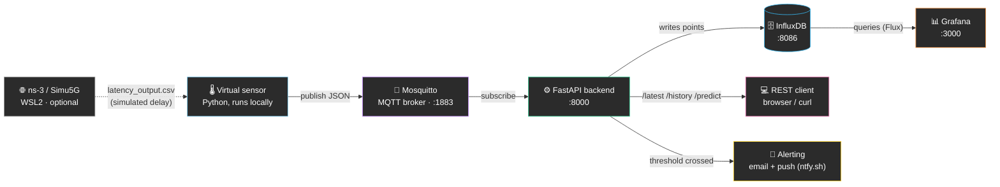

<div align="center">

# 💧 Water Filter Monitor

**Simulated IoT system for real-time water filter health monitoring and clogging-time prediction.**

Dissertation project — virtual sensor, MQTT messaging, time-series storage, ML-based prediction, live dashboard, dual-channel alerting.


</div>

---

## 📖 Contents

- [What it does](#-what-it-does)
- [Architecture](#-architecture)
- [Tech stack](#-tech-stack)
- [Quick start](#-quick-start)
- [Backend API](#-backend-api)
- [Project structure](#-project-structure)
- [How the prediction works](#-how-the-prediction-works)
- [Full documentation](#-full-documentation)

---

## 🎯 What it does

Simulates an IoT sensor mounted on a water filter, measuring **differential
pressure**, **flow rate**, and **turbidity** in real time. As the filter
clogs, pressure rises exponentially and flow drops — just like a real
filter. The system:

- 📡 collects data over **MQTT**, the standard IoT messaging protocol;
- 🗄️ stores the full history in a **time-series database** (InfluxDB);
- 📊 displays it live on an auto-provisioned **Grafana dashboard**;
- 🤖 **predicts**, via a regression model, how many days remain before the
  filter fully clogs;
- 🔔 sends **email + push notifications** (ntfy.sh) at 80%, 90%, and 100% of
  clogging capacity, with automatic retry on transient network failures;
- 🌐 can simulate the impact of a real network (5G) on data delivery
  latency, using results exported from an **ns-3** simulation.

---

## 🏗️ Architecture



4 of the 5 core components (Mosquitto, InfluxDB, backend, Grafana) run in
Docker containers, started with a single command. The virtual sensor runs
natively with Python, for fast iteration during development.

---

## 🧩 Tech stack

| Component | Technology | Role |
|---|---|---|
| Virtual sensor | Python 3.12, `paho-mqtt` | Simulates filter degradation, publishes to MQTT |
| Message broker | Eclipse Mosquitto 2 | MQTT transport, sensor → backend |
| Backend | FastAPI, `influxdb-client`, `scikit-learn` | REST API, data ingestion, ML prediction |
| Database | InfluxDB 2.7 | Time-series storage of readings |
| Visualization | Grafana | Live dashboard, auto-provisioned |
| Alerting | `smtplib` (SMTP) + ntfy.sh | Email + phone push at 80/90/100% clogging |
| Orchestration | Docker Compose | Start/stop the whole stack with one command |
| Network simulation *(optional)* | ns-3 / Simu5G, WSL2 | Realistic 5G latency applied as delay |

---

## 🚀 Quick start

```bash
# 1. Copy the env template and fill in real values (never commit .env)
cp .env.example .env

# 2. Start the infrastructure (Mosquitto, InfluxDB, backend, Grafana)
docker compose up --build
```

| Service | URL | Auth |
|---|---|---|
| 📊 Grafana | http://localhost:3000 | `admin` / value from `.env` |
| 🗄️ InfluxDB UI | http://localhost:8086 | `admin` / value from `.env` |
| ⚙️ Backend API | http://localhost:8000 | — |

```bash
# 3. Start the virtual sensor (separate terminal, plain Python)
cd sensor
pip install -r requirements.txt
python virtual_sensor.py
```

```bash
# 4. Verify
curl.exe http://localhost:8000/latest
curl.exe http://localhost:8000/predict
```

Open **Grafana** → the *"Water Filter Monitor"* dashboard is already
provisioned, with charts refreshing every 5 seconds.

> 🔔 To enable email/push alerts, copy `.env.secrets.example` to
> `.env.secrets` and fill in your SMTP credentials and ntfy.sh topic (see
> comments in the file for setup instructions).

> 🧭 Full step-by-step tutorial for someone starting from scratch
> (including Docker/WSL2/Python install and troubleshooting) in
> [`docs/arhitectura.md`](docs/arhitectura.md#6-tutorial-de-instalare-și-utilizare-pas-cu-pas)
> *(Romanian — original dissertation documentation)*.

---

## 📡 Backend API

| Endpoint | Description |
|---|---|
| `GET /health` | Quick liveness check |
| `GET /latest` | Latest reading received over MQTT |
| `GET /history?hours=24` | Reading history from InfluxDB |
| `GET /predict?hours=24` | Prediction: days remaining until clogging |

---

## 📁 Project structure

```
water-filter-monitor/
├── docker-compose.yml
├── sensor/                    # 🌡️ virtual sensor (Python, MQTT publisher)
│   ├── virtual_sensor.py
│   ├── filter_model.py        # mathematical degradation model
│   └── config.yaml
├── backend/                   # ⚙️ FastAPI: MQTT subscriber + InfluxDB + ML prediction + alerting
│   ├── main.py
│   ├── mqtt_subscriber.py
│   ├── db_writer.py
│   ├── ml_model.py
│   └── alerting.py            # 🔔 email + push notifications
├── esp32_firmware/            # 🔌 optional: real ESP32 sensor firmware
├── network_sim/                # 🌐 latency results from ns-3 (run separately, WSL2)
├── grafana/provisioning/       # 📊 auto-provisioned datasource + dashboard
└── docs/arhitectura.md          # 📖 full documentation + tutorial (Romanian)
```

---

## 🤖 How the prediction works

A filter's differential pressure rises **exponentially** as it clogs, so
its logarithm rises **linearly** over time — the backend fits a linear
regression (`scikit-learn`) on recent history and extrapolates the point
where pressure will reach the clogging threshold, also reporting `R²`
(fit quality) for transparency.

Full details, with formulas, in
[`docs/arhitectura.md`](docs/arhitectura.md#33-backend-ul--fastapi)
*(Romanian)*.

---

## 📖 Full documentation

[`docs/arhitectura.md`](docs/arhitectura.md) *(Romanian, part of the
original dissertation)* covers: a walkthrough of every component, the data
flow diagram, service-to-service links, the full install/usage tutorial, a
troubleshooting section for common issues, and the reasoning behind the
technical choices. An English translation is on the roadmap.
