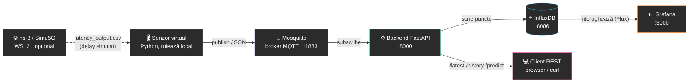

<div align="center">

# 💧 Water Filter Monitor

**Sistem IoT simulat pentru monitorizarea în timp real a stării unui filtru de apă și predicția momentului de înfundare.**

Proiect de disertație — senzor virtual, comunicație MQTT, stocare time-series, predicție ML, dashboard live.


</div>

---

## 📖 Cuprins

- [Ce face aplicația](#-ce-face-aplicația)
- [Arhitectură](#-arhitectură)
- [Stack tehnologic](#-stack-tehnologic)
- [Pornire rapidă](#-pornire-rapidă)
- [API-ul backend](#-api-ul-backend)
- [Structura proiectului](#-structura-proiectului)
- [Cum funcționează predicția](#-cum-funcționează-predicția)
- [Documentație completă](#-documentație-completă)

---

## 🎯 Ce face aplicația

Simulează un senzor IoT montat pe un filtru de apă, care măsoară în timp
real **presiunea diferențială**, **debitul** și **turbiditatea** apei. Pe
măsură ce filtrul se colmatează, presiunea crește exponențial și debitul
scade — exact ca la un filtru real. Sistemul:

- 📡 colectează datele prin **MQTT**, protocolul standard în IoT;
- 🗄️ le stochează istoric într-o bază de date **time-series** (InfluxDB);
- 📊 le afișează live pe un **dashboard Grafana**, provizionat automat;
- 🤖 **prezice** — printr-un model de regresie — peste câte zile filtrul se
  va înfunda complet;
- 🌐 poate simula impactul unei rețele reale (5G) asupra timpului de
  livrare a datelor, folosind rezultate exportate dintr-o simulare **ns-3**.

---

## 🏗️ Arhitectură



4 din cele 5 componente (Mosquitto, InfluxDB, backend, Grafana) rulează în
containere Docker, pornite cu o singură comandă. Senzorul virtual rulează
nativ cu Python, pentru iterație rapidă în timpul dezvoltării.

---

## 🧩 Stack tehnologic

| Componentă | Tehnologie | Rol |
|---|---|---|
| Senzor virtual | Python 3.12, `paho-mqtt` | Simulează degradarea filtrului, publică pe MQTT |
| Broker mesagerie | Eclipse Mosquitto 2 | Transport MQTT senzor → backend |
| Backend | FastAPI, `influxdb-client`, `scikit-learn` | API REST, scriere date, predicție ML |
| Bază de date | InfluxDB 2.7 | Stocare time-series a citirilor |
| Vizualizare | Grafana | Dashboard live, provizionat automat |
| Orchestrare | Docker Compose | Pornire/oprire infrastructură cu o comandă |
| Simulare rețea *(opțional)* | ns-3 / Simu5G, WSL2 | Latențe realiste 5G aplicate ca delay |

---

## 🚀 Pornire rapidă

```bash
# 1. Pornește infrastructura (Mosquitto, InfluxDB, backend, Grafana)
docker compose up --build
```

| Serviciu | URL | Autentificare |
|---|---|---|
| 📊 Grafana | http://localhost:3000 | `admin` / `admin` |
| 🗄️ InfluxDB UI | http://localhost:8086 | `admin` / `admin12345` |
| ⚙️ Backend API | http://localhost:8000 | — |

```bash
# 2. Pornește senzorul virtual (terminal separat, direct cu Python)
cd sensor
pip install -r requirements.txt
python virtual_sensor.py
```

```bash
# 3. Verifică
curl.exe http://localhost:8000/latest
curl.exe http://localhost:8000/predict
```

Deschide **Grafana** → dashboard-ul *"Water Filter Monitor"* apare deja
provizionat, cu grafice care se actualizează la fiecare 5 secunde.

> 🧭 Tutorial complet, pas cu pas, pentru cineva care pornește de la zero
> (inclusiv instalarea Docker/WSL2/Python și depanare) în
> [`docs/arhitectura.md`](docs/arhitectura.md#6-tutorial-de-instalare-și-utilizare-pas-cu-pas).

---

## 📡 API-ul backend

| Endpoint | Descriere |
|---|---|
| `GET /health` | Verificare rapidă că serviciul e sus |
| `GET /latest` | Ultima citire primită prin MQTT |
| `GET /history?hours=24` | Istoricul citirilor din InfluxDB |
| `GET /predict?hours=24` | Predicție: zile rămase până la înfundare |

---

## 📁 Structura proiectului

```
water-filter-monitor/
├── docker-compose.yml
├── sensor/                 # 🌡️ senzor virtual (Python, MQTT publisher)
│   ├── virtual_sensor.py
│   ├── filter_model.py     # modelul matematic de degradare
│   └── config.yaml
├── backend/                 # ⚙️ FastAPI: subscriber MQTT + InfluxDB + predicție ML
│   ├── main.py
│   ├── mqtt_subscriber.py
│   ├── db_writer.py
│   └── ml_model.py
├── network_sim/              # 🌐 rezultate latență din ns-3 (rulat separat, WSL2)
├── grafana/provisioning/      # 📊 datasource + dashboard provizionate automat
└── docs/arhitectura.md         # 📖 documentație completă + tutorial
```

---

## 🤖 Cum funcționează predicția

Presiunea diferențială a unui filtru crește **exponențial** pe măsură ce se
colmatează. Logaritmul acestei presiuni crește deci **liniar** în timp —
backend-ul potrivește o regresie liniară (`scikit-learn`) pe istoricul
recent și extrapolează matematic momentul în care presiunea va atinge
pragul de înfundare, raportând și `R²` (calitatea potrivirii) pentru
transparență.

Detalii complete, cu formule, în [`docs/arhitectura.md`](docs/arhitectura.md#33-backend-ul--fastapi).

---

## 📖 Documentație completă

[`docs/arhitectura.md`](docs/arhitectura.md) conține: explicarea fiecărei
componente, diagrama fluxului de date, legăturile dintre servicii,
tutorialul complet de instalare/utilizare, o secțiune de depanare pentru
probleme frecvente, și argumentarea alegerilor tehnice.
