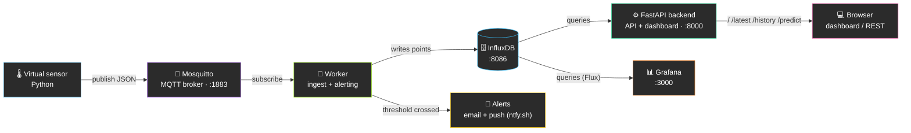
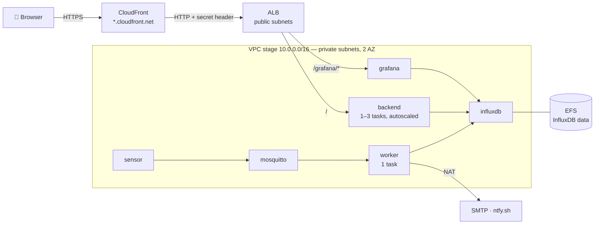

<div align="center">

# 💧 Water Filter Monitor

**Simulated IoT system for real-time water filter health monitoring and clogging-time prediction.**

Virtual sensor, MQTT messaging, time-series storage, ML-based prediction, live dashboard, dual-channel alerting —
running locally with Docker Compose and on AWS (ECS Fargate) provisioned with Terraform.


</div>

---

## 📖 Contents

- [What it does](#-what-it-does)
- [Architecture](#-architecture)
- [Tech stack](#-tech-stack)
- [Quick start (local)](#-quick-start-local)
- [Deployment on AWS](#-deployment-on-aws)
- [CI/CD](#-cicd)
- [Backend API](#-backend-api)
- [How the prediction works](#-how-the-prediction-works)
- [Alerting](#-alerting)
- [Configuration](#-configuration)
- [Project structure](#-project-structure)
- [Troubleshooting](#-troubleshooting)

---

## 🎯 What it does

Simulates an IoT sensor mounted on a water filter, measuring **differential
pressure**, **flow rate**, and **turbidity** in real time. As the filter
clogs, pressure rises exponentially and flow drops — just like a real
filter. The system:

- 📡 collects data over **MQTT**, the standard IoT messaging protocol;
- 🗄️ stores the full history in a **time-series database** (InfluxDB);
- 📊 displays it live on a **built-in dashboard** (served by the backend at
  `/`) and on an auto-provisioned **Grafana dashboard** for deeper analysis;
- 🤖 **predicts**, via a regression model, how long remains before the
  filter fully clogs;
- 🔔 sends **email + push notifications** (ntfy.sh) at 80%, 90%, and 100% of
  clogging capacity, with automatic retry on transient network failures.

---

## 🏗️ Architecture


```mermaid
flowchart LR
    S["🌡️ Virtual sensor<br/>Python"]
    M["📡 Mosquitto<br/>MQTT broker · :1883"]
    W["🔁 Worker<br/>ingest + alerting"]
    B["⚙️ FastAPI backend<br/>API + dashboard · :8000"]
    I[("🗄️ InfluxDB<br/>:8086")]
    G["📊 Grafana<br/>:3000"]
    C["💻 Browser<br/>dashboard / REST"]
    A["🔔 Alerts<br/>email + push (ntfy.sh)"]

    S -- "publish JSON" --> M
    M -- "subscribe" --> W
    W -- "writes points" --> I
    W -- "threshold crossed" --> A
    I -- "queries" --> B
    I -- "queries (Flux)" --> G
    B -- "/ /latest /history /predict" --> C

    style S fill:#2b2b2b,stroke:#7dd3fc,color:#fff
    style M fill:#2b2b2b,stroke:#c084fc,color:#fff
    style W fill:#2b2b2b,stroke:#a3e635,color:#fff
    style B fill:#2b2b2b,stroke:#34d399,color:#fff
    style I fill:#2b2b2b,stroke:#38bdf8,color:#fff
    style G fill:#2b2b2b,stroke:#fb923c,color:#fff
    style C fill:#2b2b2b,stroke:#f472b6,color:#fff
    style A fill:#2b2b2b,stroke:#facc15,color:#fff
```

Every component runs as a container. The **worker** (one instance) is the
only MQTT subscriber: it stores each reading and sends the alerts. The
**backend** only reads from InfluxDB, so it is stateless and can run as several
replicas; both use the same image with a different command. The same images
run locally (Docker Compose) and on AWS (ECS Fargate); only the addresses
differ — compose service names locally, `*.wfm.local` (AWS Cloud Map) and
CloudFront on AWS.

---

## 🧩 Tech stack

| Component | Technology | Role |
|---|---|---|
| Virtual sensor | Python 3.11+, `paho-mqtt` | Simulates filter degradation, publishes to MQTT |
| Message broker | Eclipse Mosquitto 2 | MQTT transport, sensor → worker |
| Worker | Python, `paho-mqtt`, `influxdb-client` | Single instance: stores readings, sends alerts, keeps alert state in InfluxDB |
| Backend | FastAPI, `influxdb-client`, `scikit-learn` | Stateless REST API, ML prediction, built-in dashboard |
| Database | InfluxDB 2.7 | Time-series storage of readings |
| Visualization | Grafana 13 | Live dashboard, auto-provisioned |
| Alerting | `smtplib` (SMTP) + ntfy.sh | Email + phone push at 80/90/100% clogging |
| Local orchestration | Docker Compose | Start/stop the whole stack with one command |
| Cloud | AWS ECS Fargate (ARM64), ALB, CloudFront, EFS, Cloud Map, SSM | Production-like deployment |
| Infrastructure as code | Terraform (S3 remote state) | Layered, create/destroy on demand |
| CI/CD | GitHub Actions + OIDC | Build, scan, deploy; on-demand stage environment |

---

## 🚀 Quick start (local)

**Prerequisites:** Docker Desktop (with the WSL2 engine on Windows).

```bash
# 1. Copy the env template (defaults are fine for local dev; never commit .env)
cp .env.example .env

# 2. Start the whole stack: Mosquitto, InfluxDB, worker, backend, virtual sensor, Grafana
docker compose up -d --build

# 3. Verify
curl.exe http://localhost:8000/latest
curl.exe http://localhost:8000/predict
```

| Service | URL | Auth |
|---|---|---|
| 💧 Dashboard | http://localhost:8000 | — |
| 📊 Grafana | http://localhost:3000 | `admin` / value from `.env` |
| 🗄️ InfluxDB UI | http://localhost:8086 | `admin` / value from `.env` |
| ⚙️ Backend API | http://localhost:8000/docs | — |

In Grafana the *"Water Filter Monitor"* dashboard is already provisioned, with
charts refreshing every 5 seconds.

To iterate on the sensor without rebuilding its image, stop the container and
run it with plain Python — it reads the same `config.yaml`:

```bash
docker compose stop sensor
cd sensor
pip install -r requirements.txt
python virtual_sensor.py
```

> 🔔 To enable email/push alerts, copy `.env.secrets.example` to
> `.env.secrets` and fill in your SMTP credentials and ntfy.sh topic (see
> comments in the file).

---

## ☁️ Deployment on AWS

The infrastructure lives in `terraform/`, split into layers with separate
state files in S3. The permanent layers cost almost nothing; the expensive
one (`stage-app`) is created and destroyed on demand.


```mermaid
flowchart LR
    U["👤 Browser"] -- "HTTPS" --> CF["CloudFront<br/>*.cloudfront.net"]
    CF -- "HTTP + secret header" --> ALB["ALB<br/>public subnets"]
    subgraph VPC["VPC stage 10.0.0.0/16 — private subnets, 2 AZ"]
        B["backend<br/>1–3 tasks, autoscaled"]
        G["grafana"]
        M["mosquitto"]
        W["worker<br/>1 task"]
        I["influxdb"]
        S["sensor"]
    end
    ALB -- "/" --> B
    ALB -- "/grafana/*" --> G
    S --> M --> W --> I
    B --> I
    G --> I
    I --- EFS[("EFS<br/>InfluxDB data")]
    W -- "NAT" --> N["SMTP · ntfy.sh"]
```

| Layer | What it creates | Lifetime |
|---|---|---|
| `bootstrap/` | S3 bucket for Terraform state (versioned, encrypted) | permanent, local state |
| `shared/` | VPC `10.3.0.0/16`, ECR repositories, JumpHost (SSM only, stopped by default), GitHub OIDC provider + CI/CD roles | permanent |
| `stage-base/` | VPC `10.0.0.0/16` + peering, security groups, EFS, ECS cluster, log groups, secrets and the deployed image tag in SSM Parameter Store | permanent |
| `stage-app/` | NAT gateway, IAM task roles, Cloud Map (`wfm.local`), task definitions, 6 ECS services, ALB, CloudFront, backend autoscaling | **on demand** (~0.15 $/h) |
| `modules/network/` | reusable VPC module (public/private subnets in 2 AZ) | — |

Highlights:

- **ARM64 (Graviton) Fargate** tasks in private subnets; outbound traffic through NAT.
- **Secrets** in SSM Parameter Store (`SecureString`), injected by ECS; generated
  ones never touch the Terraform state (ephemeral + write-only).
- **HTTPS** via CloudFront's default certificate. The ALB accepts only the
  CloudFront prefix list **and** a secret origin header (403 otherwise).
- **InfluxDB data on EFS**, so it survives `stage-app` destroy/create.
- **Single-instance services** (InfluxDB, sensor, worker) deploy
  stop-then-start, so two copies never run at once (shared files, a second
  simulated filter, duplicate alerts).
- **Autoscaling**: the stateless backend scales 1–3 tasks on 50% average CPU.

Normally everything runs from GitHub Actions (next section). The same steps by
hand (AWS CLI profile and Terraform configured):

```powershell
$env:AWS_PROFILE = "wfm"
powershell -ExecutionPolicy Bypass -File .\scripts\build-push.ps1   # ARM64 images -> ECR, tag = commit SHA -> SSM
cd terraform\stage-app
terraform apply                                                      # ~5 min, prints app_url
terraform destroy                                                    # when done (~10 min, CloudFront)
```

`stage-app` reads the image tag from SSM (`/wfm/stage/image_tag`); pass
`-var image_tag=<sha>` to run another version.

Helper scripts: `scripts/build-push.ps1` (build + push to ECR),
`scripts/set-stage-secrets.ps1` (upload `.env.secrets` to SSM),
`scripts/load-test.py` (load generator for the autoscaling test).

---

## 🔄 CI/CD

GitHub Actions authenticates to AWS with **OIDC** — no access keys stored in
GitHub. Each job gets a signed token; AWS STS exchanges it for 1-hour
credentials only if the token matches the role's trust policy exactly.

| Workflow | Trigger | What it does |
|---|---|---|
| `ci.yml` | pull request to `main` | `terraform fmt` + `validate` (4 layers), Python byte-compile + `pip check`, ARM64 Docker build of the 4 images — no AWS access |
| `deploy.yml` | push to `main` touching app code | build ARM64 images on a native ARM runner → ECR (tag = short SHA) → fail on CRITICAL CVEs from the ECR scan → publish the tag to SSM → if `stage-app` is running: `terraform apply`, wait for ECS services, smoke test |
| `stage.yml` | manual (`create` / `destroy`), nightly at 20:00 UTC | on-demand environment: create `stage-app` + smoke test, or destroy it; the nightly run destroys a forgotten stack |

| IAM role | Who can assume it | Can do |
|---|---|---|
| `wfm-github-build` | jobs on `main` of this repo | push to the 4 `wfm/*` ECR repositories |
| `wfm-github-deploy` | jobs in the GitHub environment `stage` (restricted to `main`) | Terraform on `stage-app` only: its state object, NAT/ALB/ECS/Cloud Map/CloudFront, and `wfm-stage-*` IAM roles |

The deploy role can create IAM roles only with the **permissions boundary**
`wfm-stage-role-boundary` (ECR pull, ECS logs, `/wfm/stage/*` parameters, ECS
Exec), and cannot remove it — so a pipeline change cannot mint an admin role.
Both terraform workflows share a concurrency group, so only one run touches the
`stage-app` state at a time (S3 native locking guards local runs too).

---

## 📡 Backend API

Locally at `http://localhost:8000` (interactive docs at `/docs`); on AWS at the CloudFront address.

| Endpoint | Description |
|---|---|
| `GET /` | Built-in dashboard (static HTML/CSS/JS, polls the endpoints below) |
| `GET /health` | Quick liveness check (also used by the ALB) |
| `GET /latest` | Most recent reading (last point in InfluxDB) |
| `GET /history?hours=24` | Reading history from InfluxDB (`hours` 0.05–720, fractional allowed) |
| `GET /predict?hours=24` | Prediction: time remaining until clogging, plus `R²` |
| `GET /config` | Public links for the dashboard (Grafana URL for the current environment) |

The dashboard is plain static files in `backend/static/`, mounted with FastAPI's
`StaticFiles`. It shares the backend's origin, so there is no CORS to configure.

---

## 🤖 How the prediction works

As a filter clogs, its hydraulic resistance grows **exponentially**. The filter
sits in series with the rest of the plumbing, fed at the mains supply pressure
`P_s` (4 bar), so with `x = R_filter / R_system`:

```
x(t) = x0 · e^(k·t)          pressure = P_s · x / (1 + x)          flow ∝ P_s − pressure
```

The pressure drop starts at the new-filter value, rises almost exponentially and
levels off smoothly at `P_s` (a fully blocked filter takes the whole supply
pressure) while the flow falls to zero. Inverting gives a transform that is
**linear in time**:

```
ln( pressure / (P_s − pressure) ) = ln(x0) + k·t
```

`ml_model.py` fits a linear regression (`scikit-learn`) on that transform vs
elapsed seconds, using only the **current filter cycle** (a pressure drop
> 0.3 bar or a gap > 10 min starts a new one), and solves for the time the
pressure reaches the clog threshold (`1.5 bar`). The `/predict` response also
returns `R²` so the caller can judge the fit; once past the threshold it reports
`clogged` and since when. Because `k` is learned from the data rather than read
from the simulator, the same model would work on real sensor readings. The
simulator's exact time-to-clog is published alongside, for comparison.

---

## 🔔 Alerting

`alerting.py` runs in the worker's MQTT message handler. On every reading it
computes the clogging percentage (`pressure ÷ threshold`) and fires a
notification when it crosses **80%, 90%, 100%**:

- each threshold fires **once per filter cycle**; the thresholds already
  notified are also saved in InfluxDB (`alert_event`) and restored when the
  worker starts, so a restart or redeploy does not repeat them;
- the worker runs as a **single instance** — alerting lives outside the
  scalable API, otherwise every API replica would send its own copy;
- if pressure drops below 50% (filter replaced / sensor restarted) the set
  resets, so the next cycle can alert again;
- each send (email over SMTP + push via [ntfy.sh](https://ntfy.sh)) is
  retried up to 3 times, so a transient network error doesn't drop an alert;
- alerts link to the dashboard and to Grafana (`APP_URL`, `GRAFANA_URL`);
  tapping the push notification opens the dashboard.

Credentials come from `.env.secrets` locally (git-ignored) and from SSM
Parameter Store on AWS. Without them, alerts are skipped and the rest of the
system runs normally.

---

## ⚙️ Configuration

| Where | Purpose |
|---|---|
| `sensor/config.yaml` | Simulation parameters — clogging rate, base values, `clog_threshold_bar`, `supply_pressure_bar` (mains pressure), raw-water turbidity, `time_acceleration`, publish interval |
| `.env` (from `.env.example`) | Local passwords/token read by `docker-compose.yml`; connection values for running the Python code outside Docker |
| `.env.secrets` (from `.env.secrets.example`) | SMTP + ntfy.sh credentials for alerting — **never committed** |
| `docker-compose.yml` | Local services, ports, volumes, `APP_URL` / `GRAFANA_URL` |
| `grafana/provisioning/` | Datasource + dashboard, baked into the Grafana image |
| `terraform/stage-app/task-definitions.tf` | Same settings for AWS (addresses, sizes, secrets from SSM) |

> Mosquitto allows anonymous access (`allow_anonymous true`) — fine for local
> development; on AWS it is reachable only from the sensor and worker
> security groups. For a real device fleet, add authentication and TLS.

---

## 📁 Project structure

```
water-filter-monitor/
├── docker-compose.yml          # local stack (same images as AWS)
├── .env.example                # local config template        ->  copy to .env
├── .env.secrets.example        # alerting credentials template ->  copy to .env.secrets
├── sensor/                     # virtual sensor (Python, MQTT publisher)
│   ├── virtual_sensor.py       #   main loop: compute reading, publish to MQTT
│   ├── filter_model.py         #   mathematical degradation model
│   └── config.yaml             #   simulation parameters
├── backend/                    # one image, two entry points
│   ├── main.py                 #   API: REST endpoints + ML prediction, serves static/
│   ├── worker.py               #   worker: MQTT -> InfluxDB + alerts (single instance)
│   ├── mqtt_subscriber.py      #   receives readings, writes them, checks alerts
│   ├── db_writer.py            #   InfluxDB wrapper (readings + alert state)
│   ├── ml_model.py             #   clogging-time prediction
│   ├── alerting.py             #   email + push notifications
│   └── static/                 #   built-in dashboard (index.html, style.css, app.js)
├── mosquitto/                  # broker config, baked into a custom image
├── grafana/                    # pinned Grafana + provisioning, baked into a custom image
├── .github/workflows/          # ci.yml, deploy.yml, stage.yml (see "CI/CD")
├── scripts/                    # build-push.ps1, set-stage-secrets.ps1, load-test.py
└── terraform/                  # AWS infrastructure (see "Deployment on AWS")
    ├── bootstrap/  shared/  stage-base/  stage-app/
    └── modules/network/
```

---

## 🩺 Troubleshooting

**`curl` in PowerShell shows a security warning** — it's an alias for
`Invoke-WebRequest`. Use `curl.exe` explicitly.

**`python` / `pip` not found on Windows** — the Microsoft Store stub is
intercepting. Install real Python (`winget install Python.Python.3.12`) and
reopen the terminal.

**Grafana shows "No data" on every panel** — usually the sensor isn't
running (`curl.exe http://localhost:8000/latest` returns `no_data`) or the
selected time range doesn't cover the data (widen it, top right).

**`docker compose up` fails with a WSL2 / virtualization error** — enable the
missing Windows components: run `wsl --install --no-distribution` as
Administrator, then restart.

**ECS task keeps restarting on AWS** — check its log group
(`/ecs/wfm-stage/<service>` in CloudWatch). A sensor task that starts before
Mosquitto is registered in Cloud Map fails once and is restarted by ECS; that
is expected.
