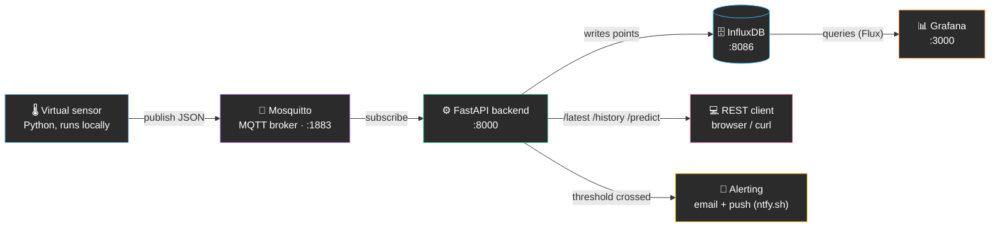

<div align="center">

# 💧 Water Filter Monitor

**Simulated IoT system for real-time water filter health monitoring and clogging-time prediction.**

Virtual sensor, MQTT messaging, time-series storage, ML-based prediction, live dashboard, dual-channel alerting.


</div>

---

## 📖 Contents

- [What it does](#-what-it-does)
- [Architecture](#-architecture)
- [Tech stack](#-tech-stack)
- [Quick start](#-quick-start)
- [Backend API](#-backend-api)
- [How the prediction works](#-how-the-prediction-works)
- [Alerting](#-alerting)
- [Configuration](#-configuration)
- [Project structure](#-project-structure)
- [Troubleshooting](#-troubleshooting)

---

## 🎯 What it does

Simulates an IoT sensor mounted on a water filter, measuring **differential
pressure**, **flow rate**, and **turbidity** in real time. As the filter
clogs, pressure rises exponentially and flow drops — just like a real
filter. The system:

- 📡 collects data over **MQTT**, the standard IoT messaging protocol;
- 🗄️ stores the full history in a **time-series database** (InfluxDB);
- 📊 displays it live on an auto-provisioned **Grafana dashboard**;
- 🤖 **predicts**, via a regression model, how many days remain before the
  filter fully clogs;
- 🔔 sends **email + push notifications** (ntfy.sh) at 80%, 90%, and 100% of
  clogging capacity, with automatic retry on transient network failures.

---

## 🏗️ Architecture


```mermaid
flowchart LR
    S["🌡️ Virtual sensor<br/>Python, runs locally"]
    M["📡 Mosquitto<br/>MQTT broker · :1883"]
    B["⚙️ FastAPI backend<br/>:8000"]
    I[("🗄️ InfluxDB<br/>:8086")]
    G["📊 Grafana<br/>:3000"]
    C["💻 REST client<br/>browser / curl"]
    A["🔔 Alerting<br/>email + push (ntfy.sh)"]

    S -- "publish JSON" --> M
    M -- "subscribe" --> B
    B -- "writes points" --> I
    I -- "queries (Flux)" --> G
    B -- "/latest /history /predict" --> C
    B -- "threshold crossed" --> A

    style S fill:#2b2b2b,stroke:#7dd3fc,color:#fff
    style M fill:#2b2b2b,stroke:#c084fc,color:#fff
    style B fill:#2b2b2b,stroke:#34d399,color:#fff
    style I fill:#2b2b2b,stroke:#38bdf8,color:#fff
    style G fill:#2b2b2b,stroke:#fb923c,color:#fff
    style C fill:#2b2b2b,stroke:#f472b6,color:#fff
    style A fill:#2b2b2b,stroke:#facc15,color:#fff
```

4 of the 5 components (Mosquitto, InfluxDB, backend, Grafana) run in Docker
containers, started with a single command. The virtual sensor runs natively
with Python, for fast iteration during development.

---

## 🧩 Tech stack

| Component | Technology | Role |
|---|---|---|
| Virtual sensor | Python 3.11+, `paho-mqtt` | Simulates filter degradation, publishes to MQTT |
| Message broker | Eclipse Mosquitto 2 | MQTT transport, sensor → backend |
| Backend | FastAPI, `influxdb-client`, `scikit-learn` | REST API, data ingestion, ML prediction |
| Database | InfluxDB 2.7 | Time-series storage of readings |
| Visualization | Grafana | Live dashboard, auto-provisioned |
| Alerting | `smtplib` (SMTP) + ntfy.sh | Email + phone push at 80/90/100% clogging |
| Orchestration | Docker Compose | Start/stop the whole stack with one command |

---

## 🚀 Quick start

**Prerequisites:** Docker Desktop (with the WSL2 engine on Windows) and
Python 3.11+ for the virtual sensor. The backend runs in a `python:3.11-slim`
container, so nothing extra is needed for it.

```bash
# 1. Copy the env template (defaults are fine for local dev; never commit .env)
cp .env.example .env

# 2. Start the infrastructure (Mosquitto, InfluxDB, backend, Grafana)
docker compose up --build
```

| Service | URL | Auth |
|---|---|---|
| 📊 Grafana | http://localhost:3000 | `admin` / value from `.env` |
| 🗄️ InfluxDB UI | http://localhost:8086 | `admin` / value from `.env` |
| ⚙️ Backend API | http://localhost:8000 | — |

```bash
# 3. Start the virtual sensor (separate terminal, plain Python)
cd sensor
pip install -r requirements.txt
python virtual_sensor.py
```

```bash
# 4. Verify
curl.exe http://localhost:8000/latest
curl.exe http://localhost:8000/predict
```

Open **Grafana** → the *"Water Filter Monitor"* dashboard is already
provisioned, with charts refreshing every 5 seconds.

> 🔔 To enable email/push alerts, copy `.env.secrets.example` to
> `.env.secrets` and fill in your SMTP credentials and ntfy.sh topic (see
> comments in the file for setup instructions).

---

## 📡 Backend API

All endpoints are at `http://localhost:8000` (interactive docs at `/docs`).

| Endpoint | Description |
|---|---|
| `GET /health` | Quick liveness check |
| `GET /latest` | Latest reading received over MQTT (from memory) |
| `GET /history?hours=24` | Reading history from InfluxDB (`hours` 1–720) |
| `GET /predict?hours=24` | Prediction: days remaining until clogging, plus `R²` |

---

## 🤖 How the prediction works

A filter's differential pressure rises **exponentially** as it clogs, so
`ln(pressure)` rises **linearly** over time:

```
pressure(t) = base · e^(k·t)   ⟹   ln(pressure) = ln(base) + k·t
```

`ml_model.py` fits a linear regression (`scikit-learn`) on
`(elapsed_seconds, ln(pressure_drop))` over the recent history, reads the
slope `k` (the degradation rate), and solves for the time at which pressure
reaches the clog threshold (`1.5 bar` by default). The `/predict` response
also returns `R²` so the caller can judge the fit. Because `k` is learned
from the data rather than hardcoded, the same model would work on real
sensor readings.

---

## 🔔 Alerting

`alerting.py` runs inside the MQTT message handler. On every reading it
computes the clogging percentage (`pressure ÷ threshold`) and fires a
notification when it crosses **80%, 90%, 100%**:

- each threshold fires **once per filter cycle** (fired thresholds are kept
  in a set, so a reading every 5 s doesn't produce hundreds of alerts);
- if pressure drops below 50% (filter replaced / sensor restarted) the set
  resets, so the next cycle can alert again;
- each send (email over SMTP + push via [ntfy.sh](https://ntfy.sh)) is
  retried up to 3 times, so a transient network error doesn't drop an alert.

Credentials come only from `.env.secrets` (git-ignored). Without them, alerts
are skipped and the rest of the system runs normally.

---

## ⚙️ Configuration

| Where | Purpose |
|---|---|
| `sensor/config.yaml` | Simulation parameters — clogging rate, base values, `clog_threshold_bar`, `time_acceleration`, publish interval |
| `.env` (from `.env.example`) | MQTT / InfluxDB connection, `CLOG_THRESHOLD_BAR`; also read by `docker-compose.yml` |
| `.env.secrets` (from `.env.secrets.example`) | SMTP + ntfy.sh credentials for alerting — **never committed** |
| `docker-compose.yml` | Service definitions, ports, internal network |
| `grafana/provisioning/` | Datasource + dashboard, applied automatically on start |

> Mosquitto is configured with anonymous access (`allow_anonymous true`) for
> local development only. For anything exposed, add authentication and TLS.

---

## 📁 Project structure

```
water-filter-monitor/
├── docker-compose.yml
├── .env.example                # dev config template  ->  copy to .env
├── .env.secrets.example        # alerting credentials template  ->  copy to .env.secrets
├── sensor/                     # virtual sensor (Python, MQTT publisher)
│   ├── virtual_sensor.py       #   main loop: compute reading, publish to MQTT
│   ├── filter_model.py         #   mathematical degradation model
│   ├── config.yaml             #   simulation parameters
│   └── requirements.txt
├── backend/                    # FastAPI: MQTT subscriber + InfluxDB + ML prediction + alerting
│   ├── main.py                 #   app entry point, REST endpoints
│   ├── mqtt_subscriber.py      #   receives readings, writes them, checks alerts
│   ├── db_writer.py            #   InfluxDB wrapper (write + query)
│   ├── ml_model.py             #   clogging-time prediction
│   ├── alerting.py             #   email + push notifications
│   ├── Dockerfile
│   └── requirements.txt
├── mosquitto/config/           # Mosquitto broker config
└── grafana/provisioning/       # datasource + dashboard, applied automatically
```

---

## 🩺 Troubleshooting

**`curl` in PowerShell shows a security warning** — it's an alias for
`Invoke-WebRequest`. Use `curl.exe` explicitly.

**`python` / `pip` not found on Windows** — the Microsoft Store stub is
intercepting. Install real Python (`winget install Python.Python.3.12`) and
reopen the terminal.

**Grafana shows "No data" on every panel** — usually one of: the sensor
isn't running (`curl.exe http://localhost:8000/latest` returns `no_data`);
the selected time range doesn't cover the data (widen it, top right); or the
datasource UID got out of sync after a manual edit — reset it with:

```bash
docker compose rm -sf grafana
docker volume rm water-filter-monitor_grafana-data
docker compose up -d grafana
```

**`docker compose up` fails with a WSL2 / virtualization error** — enable the
missing Windows components: run `wsl --install --no-distribution` as
Administrator, then restart.
